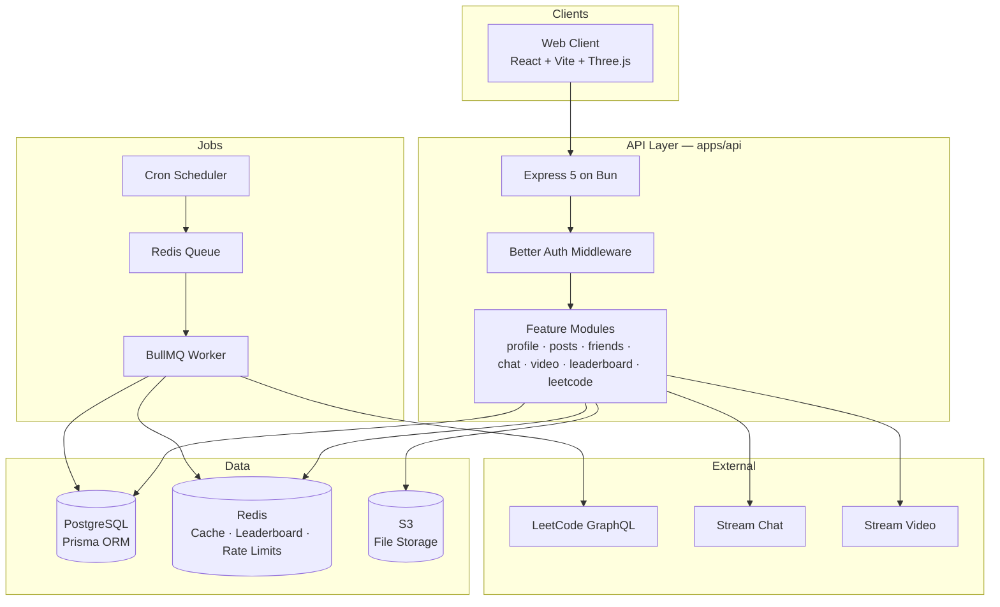

<div align="center">


<br/>

# Lumino

### Enterprise Infrastructure for Connected Campuses

> **Verified Identity • Communities • Clubs • Events • Placements • Mentorship • Campus Services**

_Building the trusted digital ecosystem for the next generation of universities._

<br/>

[](https://github.com/Lumino-x1/Lumina/actions/workflows/ci.yml)
[](https://github.com/Lumino-x1/Lumina/actions/workflows/cd.yml)
[](https://github.com/Lumino-x1/Lumina/actions/workflows/codeql.yml)
[](LICENSE)
[](CONTRIBUTING.md)

<p>
  
  
  
  
  
  
  
  
  
  
  
  
</p>

</div>

---

## Table of Contents

- [Overview](#overview)
- [Why Lumino Exists](#why-lumino-exists)
- [Product Goals](#product-goals)
- [Who Is Lumino For?](#-who-is-lumino-for)
- [Features](#-features)
- [Architecture](#-architecture)
- [Tech Stack](#-tech-stack)
- [Getting Started](#-getting-started)
- [Project Structure](#project-structure)
- [API Reference](#-api-reference)
- [Observability & Health](#-observability--health)
- [Testing](#-testing)
- [Documentation](#-documentation)
- [Roadmap](#-roadmap)
- [Contributing](#-contributing)
- [Security](#-security)
- [Support](#support)
- [License](#-license)

---

## Overview

**Lumino** is a verified, multi-tenant college community platform. It unifies institutional identity, social networking,
real-time communication, academic collaboration, career workflows, campus commerce, alumni engagement, and platform
governance under a single, policy-aware account — so a college can run student life from one trusted system instead of a
patchwork of disconnected apps.

Lumino is organized around a college/tenant model: identity rules, verification evidence, and access policies are
configurable per institution, with an explicit path from a single-college deployment to a multi-college platform. Every
module is independently extensible yet seamlessly integrated, giving institutions a modern foundation to digitize campus
life while delivering a fast, intuitive experience for students, faculty, alumni, and administrators.

## Why Lumino Exists

Campus life today is fragmented. Students bounce between WhatsApp groups, Google Forms, LinkedIn, Discord, and a dozen
other tools. Administrators juggle spreadsheets. Clubs run events on one platform and communicate on another. Career
offices track placements in silos, and there's no single, verifiable source of truth for who someone actually is on
campus.

Lumino replaces that chaos with **one verified, role-aware platform** — built like infrastructure, not a side project.

## Product Goals

Lumino's product requirements are defined by its Software Requirements Specification (SRS), which sets out five goals
that shape everything in this repository:

1. **Trusted identity** — verify student, faculty, and alumni status without exposing sensitive evidence publicly.
2. **One coherent layer** — a single social and communication surface for both casual interaction and structured
   academic collaboration.
3. **Discoverable opportunities** — surface clubs, events, internships, mentorship, placements, and marketplace activity
   through one policy-aware identity, instead of scattered tools.
4. **Scale as a platform** — grow from a single-college deployment to a multi-college platform via tenant-aware data and
   event-driven integration.
5. **Safety by design** — treat moderation, privacy, auditability, and recoverability as first-class requirements, not
   post-launch additions.

The SRS defines the platform's full intended scope across **35 functional domains** — identity & trust, social &
real-time communication, campus life, career & guidance, commerce, engagement/AI, and governance & platform operations.
This README distinguishes what's **shipped in this repository today** (see [Features](#-features)) from what the SRS
specifies for Lumino's **intended direction** (see [Roadmap](#-roadmap)) — we'd rather under-claim than describe a
feature that doesn't exist yet.

---

## 🎯 Who Is Lumino For?

Lumino is designed for educational institutions that want to replace fragmented campus tools with a single, secure, and
scalable digital ecosystem.

| Audience                | What they get                                                                                        |
| ----------------------- | ---------------------------------------------------------------------------------------------------- |
| **Students**            | One place for social feed, messaging, video calls, friends, and a live coding leaderboard            |
| **Faculty & Admins**    | Role-based access, verification workflows, and campus-wide visibility                                |
| **Clubs & Communities** | Dedicated spaces for events, posts, and member management _(data model shipped; UI/API in progress)_ |
| **Career Offices**      | Internship listings, applications, and placement pipelines _(SRS-scoped, planned)_                   |
| **Alumni**              | Verified network access, mentorship, and institutional connection _(SRS-scoped, planned)_            |
| **Engineering Teams**   | A modular Turborepo monorepo they can extend without rewriting the core                              |

**Lumino is a great fit if you:**

- 🏫 Want a unified platform for students, faculty, alumni, and administrators
- 🔐 Need verified digital identities with role-based access control
- 💬 Require real-time messaging and video calling across the institution
- 📈 Need an architecture designed to scale from one college to many

**Lumino may not be the right fit** if your institution only needs a simple notice board, a static website, or a basic
messaging app.

---

## ✨ Features

Lumino's SRS defines 398 requirements across 35 domains. The table below reflects what is **implemented in this
repository today**. For the platform's full intended scope, see [Product Goals](#product-goals) and
[Roadmap](#-roadmap).

### Shipped & Active

| Module                   | Description                                                                                           |
| ------------------------ | ----------------------------------------------------------------------------------------------------- |
| **Authentication**       | Email/password via Better Auth, with session management and email verification (Google OAuth planned) |
| **Profiles**             | Rich student profiles — avatar, cover image, skills, social links, CGPA, coding profiles              |
| **Social Feed**          | Posts with image/video media, likes, comments (with pinning), saves, visibility controls              |
| **Friends**              | Send/accept/reject requests, cancel, unfriend, mutual friends, incoming/outgoing request lists        |
| **Real-Time Chat**       | 1:1 and group conversations via Stream Chat, with server-issued chat tokens                           |
| **Video Calls**          | 1:1 and group real-time video calling via Stream Video — create, join, invite, respond, end           |
| **LeetCode Integration** | Auto-sync solved counts from public LeetCode profiles, triggered on profile update                    |
| **Leaderboard**          | Redis-powered rankings — paginated, personal rank, and "around me" view                               |
| **File Storage**         | S3 uploads for profile pictures, cover images, and post media (image + video)                         |
| **Email Verification**   | Sign-up verification and password reset emails via Better Auth + Resend                               |
| **Observability**        | Structured logs, OpenTelemetry tracing, Prometheus metrics, request correlation IDs                   |
| **Health & Readiness**   | `/health`, `/ready`, and `/ok` probes; `/metrics` Prometheus scrape endpoint                          |

### Data Model Ready, API/UI In Progress

The Prisma schema already models the following domains, so the data layer exists, but they don't yet have a complete API
surface or frontend: **Communities, Clubs, Events, Study Groups, Marketplace listings, Companies & Internships, and
Verification (student ID / face)**. These map directly to SRS-scoped domains and are the leading candidates for the next
milestones — see [Roadmap](#-roadmap).

### LeetCode Leaderboard — How It Works

Lumino ships a production-style competitive coding leaderboard that pulls **real solved counts** from LeetCode — never
manually incremented.

```text
LeetCode API
     ↓
Daily Cron (BullMQ) + Manual Sync
     ↓
Sync Worker (rate-limited, retried)
     ↓
PostgreSQL (source of truth)
     ↓
Redis ZSET (leaderboard:problems_solved)
     ↓
GET /api/leaderboard
```

- **PostgreSQL** stores `leetcodeSolved`, difficulty breakdowns, sync status, and last sync time
- **Redis ZSET** powers sub-millisecond rank lookups with `ZREVRANK`, `ZSCORE`, `ZCARD`
- **BullMQ** handles daily sync, retries, concurrency limits, and staggered job scheduling
- **Never hammers LeetCode** — controlled concurrency, exponential backoff, 5-minute manual sync cooldown

---

## 🏗 Architecture

Lumino is a **Turborepo monorepo** with a clear separation between apps, shared packages, and infrastructure.



### Design Principles

| Principle                 | Implementation                                                                                  |
| ------------------------- | ----------------------------------------------------------------------------------------------- |
| **Modular modules**       | Each domain lives in `apps/api/modules/` with router → handler → service → repo                 |
| **Durable + fast reads**  | PostgreSQL is the source of truth; Redis powers hot paths like leaderboards                     |
| **Async by default**      | Long-running work (LeetCode sync, media processing) goes through BullMQ                         |
| **Type-safe end-to-end**  | TypeScript everywhere; shared types in `@lumina/contracts`                                      |
| **Observable by default** | Every request carries a correlation ID through logs, traces, and metrics                        |
| **Cloud-native**          | Docker Compose locally; Terraform-provisioned AWS (ECS, RDS, ElastiCache) in staging/production |

### Project Structure

```text
lumina/
├── apps/
│   ├── api/                  # Express API server (Bun runtime)
│   │   ├── modules/          # Domain modules: profile, posts, friends, chat, video, leaderboard, leetcode, clubs (stub)
│   │   ├── config/           # Redis, BullMQ queue, and rate-limiter config
│   │   └── app.ts            # App wiring: middleware, routes, health checks, metrics
│   ├── web/                  # React product UI (Vite + Three.js)
│   ├── admin/                # Internal admin console (scaffolded, not yet built)
│   ├── docs/                 # Docs app (scaffolded, not yet built)
│   └── storybook/            # Design-system explorer (scaffolded, not yet built)
├── packages/
│   ├── db/                   # Prisma schema, migrations, client (@lumina/db)
│   ├── auth/                 # Better Auth configuration (email/password + Resend)
│   ├── storage/              # S3 upload/delete utilities
│   ├── observability/        # Logging, OpenTelemetry tracing, Prometheus metrics
│   ├── contracts/             # Shared TypeScript types
│   ├── validators/           # Zod validation schemas
│   ├── env/                  # Environment variable loading
│   ├── constants/             # Shared message constants
│   ├── kv/ · realtime/ · analytics/ · sdk/ · api-client/ · transactional/ · shared/  # scaffolded packages
│   └── design-system/        # UI primitives (scaffolded)
├── workers/leetcode/         # Standalone BullMQ worker process for LeetCode sync
├── infra/                    # Docker + CI support files
├── infrastructure/terraform/ # AWS infra as code (VPC, ECS, RDS, ElastiCache, S3) per environment
├── internal/scripts/         # Env setup, seed, and internal tooling scripts
├── tests/                    # Integration & unit tests (Vitest)
├── docs/                     # Architecture decisions, runbooks, operational guides
├── docker-compose.yml        # Local Postgres + Redis for development
└── turbo.json                # Turborepo pipeline config
```

---

## 🛠 Tech Stack

### Frontend

| Technology                       | Role                                   |
| -------------------------------- | -------------------------------------- |
| **React 18**                     | UI framework for the web app           |
| **Vite 8**                       | Dev server and production bundler      |
| **Three.js + React Three Fiber** | 3D visuals and interactive UI elements |
| **TypeScript**                   | Full type safety across the frontend   |

### Backend

| Technology              | Role                                                           |
| ----------------------- | -------------------------------------------------------------- |
| **Bun**                 | High-performance JavaScript runtime for the API server         |
| **Express 5**           | HTTP routing, middleware, REST API                             |
| **Better Auth**         | Authentication, sessions, email verification                   |
| **Resend**              | Transactional email (verification, password reset)             |
| **Zod**                 | Runtime request validation                                     |
| **Multer**              | Multipart file upload handling                                 |
| **Fluent FFmpeg**       | Video processing for post media                                |
| **image-size**          | Image dimension extraction for uploaded media                  |
| **Stream Chat / Video** | Real-time messaging and video-calling infrastructure           |
| **express-rate-limit**  | Global and per-route rate limiting (e.g. video token issuance) |

### Data & Infrastructure

| Technology        | Role                                                                                       |
| ----------------- | ------------------------------------------------------------------------------------------ |
| **PostgreSQL 16** | Primary relational database (system of record)                                             |
| **Prisma 7**      | ORM, migrations, type-safe queries                                                         |
| **Redis 7**       | Leaderboard ZSETs, BullMQ backend, rate limiting                                           |
| **BullMQ 6**      | Job queues, retries, cron schedulers, concurrency control                                  |
| **ioredis**       | Redis client for Node/Bun                                                                  |
| **AWS S3**        | Object storage for media files (`@aws-sdk/client-s3`)                                      |
| **Terraform**     | AWS infrastructure as code — VPC, ECS, RDS, ElastiCache, S3, across dev/staging/production |

### Observability

| Technology          | Role                                                                                |
| ------------------- | ----------------------------------------------------------------------------------- |
| **OpenTelemetry**   | Distributed tracing helpers (`withSpan`) exported from `@lumina/observability`      |
| **Prometheus**      | `prom-client`-backed metrics at `GET /metrics` — HTTP, DB, Redis, and queue metrics |
| **Structured logs** | JSON logs correlated by `request_id` / `trace_id` across API and worker processes   |

### DevOps & Tooling

| Technology         | Role                                                        |
| ------------------ | ----------------------------------------------------------- |
| **Turborepo**      | Monorepo build orchestration and caching                    |
| **Docker Compose** | Local development infrastructure (Postgres + Redis)         |
| **GitHub Actions** | CI (`ci.yml`), CD (`cd.yml`), CodeQL, and dependency review |
| **Trivy**          | Container vulnerability scanning in CI/CD                   |
| **Dependabot**     | Automated dependency update PRs                             |
| **Qodana**         | Static analysis in CI                                       |
| **Vitest**         | Unit and integration testing                                |
| **Prettier**       | Code and Markdown formatting                                |
| **OxLint**         | Fast linting for the web app                                |

---

## 🚀 Getting Started

### Prerequisites

- [Bun](https://bun.sh) ≥ 1.3
- [Docker](https://www.docker.com/) (for Postgres + Redis)
- Node.js ≥ 18 (for tooling compatibility)

### 1. Clone & install

```bash
git clone https://github.com/Lumino-x1/Lumina.git
cd lumina
bun install
```

### 2. Configure environment

```bash
cp .env.example .env
```

Fill in the values your workflow needs. At minimum: `DATABASE_URL`, `REDIS_URL`, and `BETTER_AUTH_SECRET`. For the full
feature set, also set `RESEND_API_KEY`/`RESEND_FROM` (email), `AWS_*` (file storage), and
`STREAM_API_KEY`/`STREAM_API_SECRET` (chat & video).

### 3. Start infrastructure

```bash
make docker-up
# or: docker compose up db redis -d
```

### 4. Set up the database

```bash
make db-generate
make db-migrate
```

### 5. Run the platform

```bash
# All apps (API + web)
make dev

# API only
bun run dev:api

# Web UI only
bun run dev:web
```

| Service       | Default URL             |
| ------------- | ----------------------- |
| API Server    | `http://localhost:3000` |
| Web UI        | `http://localhost:5173` |
| Prisma Studio | `make db-studio`        |

### Useful commands

```bash
make help           # Show all available commands
make test           # Run test suite
make lint           # Lint all packages
make typecheck      # TypeScript check
make format         # Format with Prettier
make docker-logs    # Tail infrastructure logs

# Or via bun directly:
bun run check        # format:check + lint + check-types + check-openapi
bun run format:check # Verify formatting without writing changes
```

---

## 📡 API Reference

API endpoints are mounted below `/api`. Protected routes require authentication via session cookies issued by Better
Auth (`better-auth.session_token`). The full contract is defined in [`openapi.yaml`](openapi.yaml).

### Profile

| Method  | Endpoint          | Description                                 |
| ------- | ----------------- | ------------------------------------------- |
| `GET`   | `/api/profile/me` | Get the current user's profile              |
| `PATCH` | `/api/profile/me` | Update or create the current user's profile |

### Friends

| Method   | Endpoint                                 | Description                  |
| -------- | ---------------------------------------- | ---------------------------- |
| `GET`    | `/api/friends`                           | List accepted friends        |
| `POST`   | `/api/friends/request/:userId`           | Send a friend request        |
| `PATCH`  | `/api/friends/request/:requestId/accept` | Accept a friend request      |
| `PATCH`  | `/api/friends/request/:requestId/reject` | Reject a friend request      |
| `DELETE` | `/api/friends/request/:requestId`        | Cancel a friend request      |
| `DELETE` | `/api/friends/:friendId`                 | Remove a friend              |
| `GET`    | `/api/friends/mutual/:userId`            | Get mutual friends           |
| `GET`    | `/api/friends/requests/incoming`         | Get incoming friend requests |
| `GET`    | `/api/friends/requests/outgoing`         | Get outgoing friend requests |

### Posts

| Method   | Endpoint                                 | Description                       |
| -------- | ---------------------------------------- | --------------------------------- |
| `POST`   | `/api/posts`                             | Create a post with optional media |
| `GET`    | `/api/posts/saved`                       | Get saved posts                   |
| `POST`   | `/api/posts/:id/like`                    | Like a post                       |
| `GET`    | `/api/posts/:id/likes/count`             | Get post like count               |
| `GET`    | `/api/posts/:id/comments`                | Get comments for a post           |
| `POST`   | `/api/posts/:id/comments`                | Add a comment to a post           |
| `PATCH`  | `/api/posts/:id/comments/:commentId/pin` | Pin or unpin a comment            |
| `DELETE` | `/api/posts/:id/comments/:commentId`     | Delete a comment                  |
| `POST`   | `/api/posts/:id/save`                    | Save a post                       |

### Leaderboard

| Method | Endpoint                     | Description                                                         |
| ------ | ---------------------------- | ------------------------------------------------------------------- |
| `GET`  | `/api/leaderboard`           | Get the paginated coding leaderboard (`page`, `limit` query params) |
| `GET`  | `/api/leaderboard/me`        | Get the current user's rank and solved count                        |
| `GET`  | `/api/leaderboard/me/around` | Get users ranked near the current user                              |
| `GET`  | `/api/leaderboard/:userId`   | Get leaderboard stats for a user                                    |

### Video (`/api/video`)

| Method | Endpoint                           | Description                                                   |
| ------ | ---------------------------------- | ------------------------------------------------------------- |
| `POST` | `/api/video/token`                 | Generate a Stream Video user JWT token (rate-limited)         |
| `POST` | `/api/video/calls`                 | Create a 1-on-1 or group video call (rate-limited)            |
| `GET`  | `/api/video/calls/history`         | Get the current user's video call history                     |
| `GET`  | `/api/video/calls/:callId`         | Get video call details and participant status                 |
| `POST` | `/api/video/calls/:callId/join`    | Authorize join and return Stream call credentials             |
| `POST` | `/api/video/calls/:callId/respond` | Accept or decline a video call invitation (`ACCEPT`/`REJECT`) |
| `POST` | `/api/video/calls/:callId/end`     | End an active video call as the host                          |

Video call `type` accepts `ONE_ON_ONE`, `GROUP`, `MENTORSHIP`, `CLUB_MEETING`, or `FACULTY_SESSION`, with up to 50
`participantIds` and a 120-character `title`.

### Other

| Method | Endpoint                     | Description                                 |
| ------ | ---------------------------- | ------------------------------------------- |
| `*`    | `/api/auth/*`                | Authentication (handled by Better Auth)     |
| `GET`  | `/api/chat/conversations`    | Chat conversations                          |
| `GET`  | `/api/chat/token`            | Server-issued Stream Chat token             |
| `POST` | `/api/leetcode/sync`         | Manual LeetCode profile sync (rate-limited) |
| `GET`  | `/ok` / `/health` / `/ready` | Liveness, health, and readiness probes      |
| `GET`  | `/metrics`                   | Prometheus metrics scrape endpoint          |

All authenticated endpoints return `401 Unauthorized` when the session cookie is missing or invalid.

---

## 📈 Observability & Health

Every request is tagged with a `request_id` and `trace_id`, propagated through logs, BullMQ job payloads, and background
workers, so a single transaction can be traced end-to-end. Full details live in
[`docs/OBSERVABILITY.md`](docs/OBSERVABILITY.md).

- **Tracing** — OpenTelemetry spans via `withSpan()` from `@lumina/observability`
- **Metrics** — Prometheus counters/histograms for HTTP requests, DB queries, Redis operations, and queue depth
- **Health checks** — `/health` (liveness), `/ready` (DB + Redis dependency checks), `/ok` (basic liveness)
- **Runbooks** — operational playbooks for high latency, high error rate, and deployment rollback in
  [`docs/runbooks/`](docs/runbooks/)

---

## 🧪 Testing

```bash
bun run test              # Unit tests (tests workspace, Vitest)
bun run test:integration  # Integration tests
bun run test:coverage     # Coverage report
```

Integration tests spin up their own environment via `tests/globalSetup.ts` / `globalTeardown.ts`. See
[`tests/README.md`](tests/README.md) for details.

---

## 📚 Documentation

In-depth guides live under [`docs/`](docs/):

| Doc                                                       | Covers                                    |
| --------------------------------------------------------- | ----------------------------------------- |
| [`ARCHITECTURE.md`](docs/ARCHITECTURE.md)                 | System architecture overview              |
| [`API.md`](docs/API.md)                                   | API conventions and contract policy       |
| [`DATABASE_MIGRATIONS.md`](docs/DATABASE_MIGRATIONS.md)   | Prisma migration workflow                 |
| [`DOCKER.md`](docs/DOCKER.md)                             | Container build & security standards      |
| [`DEPLOYMENT_PIPELINE.md`](docs/DEPLOYMENT_PIPELINE.md)   | CI/CD pipeline stages                     |
| [`ENVIRONMENTS.md`](docs/ENVIRONMENTS.md)                 | Dev, staging, and production environments |
| [`OBSERVABILITY.md`](docs/OBSERVABILITY.md)               | Logging, tracing, and metrics             |
| [`OPERATIONS.md`](docs/OPERATIONS.md)                     | Day-to-day operational guidance           |
| [`SECRETS.md`](docs/SECRETS.md)                           | Secrets management                        |
| [`architecture/decisions/`](docs/architecture/decisions/) | Architecture Decision Records (ADRs)      |
| [`video-calls/`](docs/video-calls/)                       | Video call system design and API          |
| [`runbooks/`](docs/runbooks/)                             | Incident response playbooks               |

---

## 🗺 Roadmap

Lumino is under active development. Near-term priorities align with the SRS domains whose data model already ships but
whose API/UI is still in progress — **Clubs, Communities, Events, Study Groups, Marketplace, and Internships** —
alongside:

- 📱 **Mobile apps** (React Native)
- 🔔 **Push notifications** (web + mobile)
- 🪪 **Student ID & face verification** workflows
- 🔐 **Google OAuth** sign-in
- 📊 **Analytics dashboards** for admins and club leads
- 🔍 **Full-text search** across posts, users, and events
- 🌐 **Public API** for third-party integrations

See the full [ROADMAP.md](ROADMAP.md) for details.

---

## 🤝 Contributing

We welcome contributions from the community. Whether it's a bug fix, a new feature, or documentation improvements —
every PR matters.

1. Read [CONTRIBUTING.md](CONTRIBUTING.md) for setup, branching, and commit conventions
2. Check [existing issues](https://github.com/Lumino-x1/Lumina/issues) before opening a new one
3. Fork the repo, create a feature branch, and submit a PR — CI (quality checks, build, and container security scanning)
   runs automatically
4. Follow the commit convention: `feat(module): description`

Please also review our [Code of Conduct](CODE_OF_CONDUCT.md).

---

## 🔒 Security

Found a vulnerability? Please **do not** open a public issue. See [SECURITY.md](SECURITY.md) for responsible disclosure
guidelines.

Lumino's pipeline includes automated security tooling on every change: **CodeQL** static analysis, **Trivy** container
image scanning, and **Dependabot** dependency updates.

---

## Support

See [SUPPORT.md](SUPPORT.md) for community and support channels.

---

## 📄 License

Lumino is open source under the [MIT License](LICENSE).

---

<div align="center">

**Built with care for the next generation of campus communities.**

<br/>

[Website](https://luminohq.com) · [Roadmap](ROADMAP.md) · [Contributing](CONTRIBUTING.md) · [Security](SECURITY.md)

<br/>


</div>
