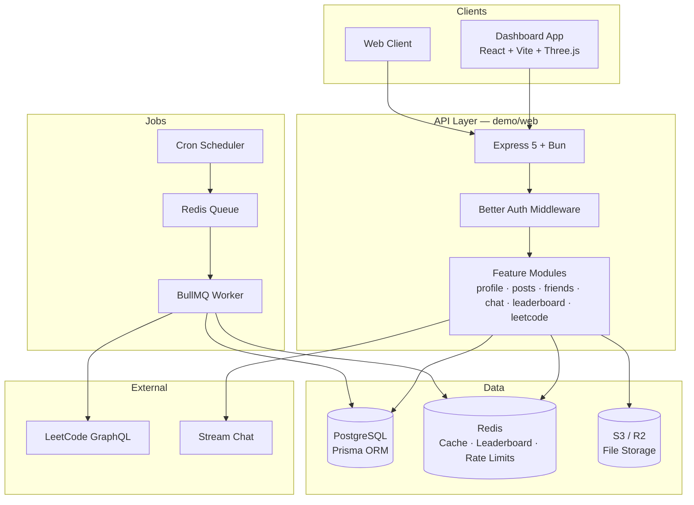

<div align="center">


<br/>

# Lumino

### Enterprise Infrastructure for Connected Campuses

> **Verified Identity • Communities • Clubs • Events • Placements • Mentorship • Campus Services**

_Building the trusted digital ecosystem for the next generation of universities._

<br/>

<p>
  
  
  
</p>

<p>
  
  
  
  
  
  
  
  
  
  
  
  
</p>

<p>
  
  
  
  
  
  
  
  
  
  
</p>

<br/>

<p align="center">
  <a href="#-overview"><strong>Overview</strong></a> •
  <a href="#-features"><strong>Features</strong></a> •
  <a href="#-architecture"><strong>Architecture</strong></a> •
  <a href="#-tech-stack"><strong>Tech Stack</strong></a> •
  <a href="#-getting-started"><strong>Getting Started</strong></a> •
  <a href="#-roadmap"><strong>Roadmap</strong></a> •
  <a href="#-contributing"><strong>Contributing</strong></a>
</p>

</div>

---

# Overview

**Lumino** is a production-grade, multi-tenant platform built to become the digital operating system for modern college
communities. It unifies verified identities, campus organizations, student engagement, career development, mentorship,
and essential campus services inside one secure, scalable ecosystem — so institutions can run their entire campus from a
single trusted platform instead of a patchwork of disconnected apps.

From a single college deployment to a nationwide academic network, Lumino is engineered for **horizontal scalability**,
**fault-tolerant services**, and **production-grade reliability**. Every module is independently extensible yet
seamlessly integrated, giving universities a modern foundation to digitize campus life while delivering a fast,
intuitive experience for students, faculty, alumni, and administrators.

### Why Lumino exists

Campus life today is fragmented. Students bounce between WhatsApp groups, Google Forms, LinkedIn, Discord, and a dozen
other tools. Administrators juggle spreadsheets. Clubs run events on one platform and communicate on another. Career
offices track placements in silos.

Lumino replaces that chaos with **one verified, role-aware platform** — built like infrastructure, not a side project.

---

## Key Highlights

- 🏫 **Multi-Tenant College Architecture** — isolated data per institution, shared platform
- 🔐 **Verified Digital Identity & RBAC** — students, faculty, alumni, admins, moderators
- 👥 **Communities, Clubs & Organizations** — structured campus groups with moderation
- 📅 **Events & Registration** — workshops, hackathons, fests with QR check-in
- 💼 **Placements & Internships** — company listings, applications, pipeline tracking
- 🏆 **LeetCode Leaderboard** — live competitive coding rankings synced from real profiles
- 💬 **Real-Time Messaging** — powered by Stream Chat with conversation management
- 📰 **Social Feed** — posts, comments, likes, media uploads, saved posts
- 🤝 **Friends & Connections** — requests, mutual friends, social graph
- 🛒 **Campus Marketplace** — buy/sell books, cycles, electronics within your college
- 📊 **Admin Dashboards** — operational visibility for college administrators
- ⚡ **Production Infrastructure** — Redis caching, BullMQ job queues, S3 storage, Docker

---


---

# 🎯 Who Is Lumino For?

Lumino is designed for educational institutions that want to replace fragmented campus tools with a single, secure, and
scalable digital ecosystem.

| Audience                | What they get                                                                            |
| ----------------------- | ---------------------------------------------------------------------------------------- |
| **Students**            | One place for social feed, messaging, clubs, events, marketplace, and coding leaderboard |
| **Faculty & Admins**    | Role-based dashboards, verification workflows, and campus-wide visibility                |
| **Clubs & Communities** | Dedicated spaces for events, posts, and member management                                |
| **Career Offices**      | Internship listings, applications, and placement pipelines                               |
| **Alumni**              | Verified network access, mentorship, and institutional connection                        |
| **Engineering Teams**   | A modular monorepo they can extend without rewriting the core                            |

**Lumino is a great fit if you:**

- 🏫 Want a unified platform for students, faculty, alumni, and administrators
- 🔐 Need verified digital identities with secure role-based access control
- 👥 Manage campus communities, clubs, departments, or student organizations
- 📅 Organize campus events, registrations, and announcements at scale
- 💼 Need a dedicated placement, internship, and career ecosystem
- 🤝 Want to connect students with alumni and mentors
- 💬 Require real-time communication and notifications across the institution
- 🛒 Want campus services like marketplaces, lost & found, and community resources
- 📈 Need an architecture that supports thousands of concurrent users across institutions

**Lumino may not be the right fit** if your institution only needs a simple notice board, static website, or basic
messaging app.

---

# 🚀 When Should You Use Lumino?

Use Lumino when your institution has outgrown disconnected tools and needs a centralized, production-grade platform.

- 🎓 Universities and colleges managing large student communities
- 🏢 Multi-campus institutions requiring centralized administration
- 🌐 Organizations building verified digital communities for education
- 📊 Institutions seeking real-time engagement and operational visibility
- 🔄 Campuses replacing multiple standalone systems with one platform
- 🔒 Environments where identity verification, security, and RBAC are critical
- ⚡ Large-scale deployments requiring reliability, scalability, and maintainability
- 🚀 Institutions preparing for long-term digital transformation

---

# ✨ Features

## Shipped & Active

| Module                      | Description                                                                |
| --------------------------- | -------------------------------------------------------------------------- |
| **Authentication**          | Email/password + Google OAuth via Better Auth, sessions, refresh tokens    |
| **Profiles**                | Rich student profiles with avatar, cover image, skills, social links, CGPA |
| **Social Feed**             | Posts with image/video media, likes, comments, saves, visibility controls  |
| **Friends**                 | Send/accept/reject requests, unfriend, mutual friends                      |
| **Real-Time Chat**          | 1:1 and group conversations via Stream Chat                                |
| **LeetCode Integration**    | Auto-sync solved counts from public LeetCode profiles                      |
| **Leaderboard**             | Redis-powered rankings — paginated, personal rank, around-me view          |
| **File Storage**            | S3-compatible uploads for profile pictures, covers, and post media         |
| **Verification**            | Student ID, face, and email verification workflows                         |
| **Multi-Tenant Data Model** | Colleges, departments, clubs, communities, events, marketplace             |

## LeetCode Leaderboard — How It Works

Lumino ships a production-style competitive coding leaderboard that pulls **real solved counts** from LeetCode — never
manually incremented.

```
LeetCode API
     ↓
Daily Cron (BullMQ) + Manual Sync
     ↓
Sync Worker (rate-limited, retried)
     ↓
PostgreSQL (source of truth)
     ↓
Redis ZSET (leaderboard:problems_solved)
     ↓
GET /api/leaderboard
```

- **PostgreSQL** stores `leetcodeSolved`, difficulty breakdowns, sync status, and last sync time
- **Redis ZSET** powers sub-millisecond rank lookups with `ZREVRANK`, `ZSCORE`, `ZCARD`
- **BullMQ** handles daily sync, retries, concurrency limits, and staggered job scheduling
- **Never hammers LeetCode** — controlled concurrency, exponential backoff, 5-minute manual sync cooldown

## Coming Soon

See the full [Roadmap →](ROADMAP.md) for planned features including push notifications, study groups, advanced
analytics, mobile apps, and institution-wide admin tooling.

---

# 🏗 Architecture

Lumino is a **Turborepo monorepo** with a clear separation between apps, shared packages, and infrastructure.



### Design Principles

| Principle                | Implementation                                                          |
| ------------------------ | ----------------------------------------------------------------------- |
| **Modular modules**      | Each domain lives in `modules/` with handler → service → repo           |
| **Durable + fast reads** | PostgreSQL is source of truth; Redis powers hot paths like leaderboards |
| **Async by default**     | Long-running work (LeetCode sync, media processing) goes through BullMQ |
| **Type-safe end-to-end** | TypeScript everywhere, shared types in `@lumina/core/contracts`              |
| **Cloud-native**         | Docker Compose locally, Vercel + managed Postgres/Redis in production   |

### Monorepo Structure

```
lumina/
├── apps/
│   ├── api/                  # Express API server (Bun runtime)
│   │   ├── modules/          # Domain modules (profile, posts, chat, leaderboard, leetcode)
│   │   ├── cron/             # Scheduled jobs (daily LeetCode sync)
│   │   └── config/           # Redis + BullMQ queues
│   ├── web/                  # React product UI (Vite + Three.js)
│   ├── admin/                # Internal console (stub)
│   ├── docs/                 # Docs app (stub)
│   └── storybook/            # Design-system explorer (stub)
├── packages/
│   ├── db/                   # Prisma schema, migrations, client (@lumina/db)
│   ├── auth/                 # Better Auth configuration
│   ├── storage/              # S3/R2 file upload utilities
│   ├── constants/            # Shared message constants
│   ├── contracts/            # Shared TypeScript types
│   ├── env/                  # Environment variable validation
│   ├── design-system/        # UI primitives
│   ├── shared/               # Cross-cutting helpers
│   ├── validators/           # Validation schemas
│   ├── observability/        # Logging
│   ├── kv/                   # Cache layer
│   ├── transactional/        # Emails
│   ├── realtime/             # Notifications
│   ├── sdk/                  # Public SDK (stub)
│   ├── analytics/            # Analytics (stub)
│   └── api-client/           # HTTP client (stub)
├── tooling/                  # Shared eslint / tsconfig / prettier
├── demo/worker-leetcode/         # BullMQ LeetCode worker
├── infra/                    # Docker + CI stubs
├── packages/cli/src/         # Seed and internal scripts
├── tests/                    # Integration & unit tests (Vitest)
├── docker-compose.yml        # Local Postgres + Redis + services
└── turbo.json                # Turborepo pipeline config
```

---

# 🛠 Tech Stack

## Frontend

| Technology                       | Role                                             |
| -------------------------------- | ------------------------------------------------ |
| **React 18**                     | UI framework for the web app                     |
| **Vite 8**                       | Lightning-fast dev server and production bundler |
| **Three.js + React Three Fiber** | 3D visuals and interactive UI elements           |
| **TypeScript**                   | Full type safety across the frontend             |

## Backend

| Technology        | Role                                                   |
| ----------------- | ------------------------------------------------------ |
| **Bun**           | High-performance JavaScript runtime for the API server |
| **Express 5**     | HTTP routing, middleware, REST API                     |
| **Better Auth**   | Authentication, sessions, OAuth, 2FA-ready             |
| **Zod**           | Runtime request validation                             |
| **Multer**        | Multipart file upload handling                         |
| **Fluent FFmpeg** | Video processing for post media                        |

## Data & Infrastructure

| Technology                 | Role                                                      |
| -------------------------- | --------------------------------------------------------- |
| **PostgreSQL 16**          | Primary relational database                               |
| **Prisma 7**               | ORM, migrations, type-safe queries                        |
| **Redis 7**                | Leaderboard ZSETs, BullMQ backend, rate limiting          |
| **BullMQ 6**               | Job queues, retries, cron schedulers, concurrency control |
| **ioredis**                | Redis client for Node/Bun                                 |
| **AWS S3 / Cloudflare R2** | Object storage for media files                            |
| **Stream Chat**            | Real-time messaging infrastructure                        |

## DevOps & Tooling

| Technology         | Role                                     |
| ------------------ | ---------------------------------------- |
| **Turborepo**      | Monorepo build orchestration and caching |
| **Docker Compose** | Local development infrastructure         |
| **GitHub Actions** | CI/CD pipelines                          |
| **Vitest**         | Unit and integration testing             |
| **Prettier**       | Code formatting                          |
| **OxLint**         | Fast linting for the dashboard app       |

---

# 🚀 Getting Started

### Prerequisites

- [pnpm](https://pnpm.io) 10.15.1 (`corepack enable`)
- [Docker](https://www.docker.com/) (for Postgres + Redis)
- Node.js ≥ 20

### 1. Clone & install

```bash
git clone https://github.com/Lumino-x1/Lumina.git
cd lumina
pnpm install
```

### 2. Configure environment

```bash
cp .env.example .env
# Fill in DATABASE_URL, REDIS_URL, auth secrets, S3 credentials, etc.
```

### 3. Start infrastructure

```bash
make docker-up
# or: docker compose up db redis -d
```

### 4. Set up the database

```bash
make db-generate
make db-migrate
```

### 5. Run the platform

```bash
# All apps (API + web)
make dev

# API only
pnpm dev:api

# Web UI only
pnpm dev:web
```

| Service       | Default URL             |
| ------------- | ----------------------- |
| API Server    | `http://localhost:3000` |
| Web UI        | `http://localhost:5173` |
| Prisma Studio | `make db-studio`        |

### Useful commands

```bash
make help           # Show all available commands
make test           # Run test suite
make lint           # Lint all packages
make typecheck      # TypeScript check
make format         # Format with Prettier
make docker-logs    # Tail infrastructure logs
```

---

# 📡 API Overview

| Endpoint                         | Description                                 |
| -------------------------------- | ------------------------------------------- |
| `POST /api/auth/*`               | Authentication (Better Auth)                |
| `GET /api/profile/me`            | Current user profile                        |
| `PATCH /api/profile/me`          | Update profile + trigger LeetCode sync      |
| `GET /api/posts`                 | Social feed                                 |
| `GET /api/friends`               | Friends list & requests                     |
| `GET /api/chat/conversations`    | Chat conversations                          |
| `GET /api/leaderboard`           | Paginated coding leaderboard                |
| `GET /api/leaderboard/me`        | Your rank and solved count                  |
| `GET /api/leaderboard/me/around` | Users ranked near you                       |
| `POST /api/leetcode/sync`        | Manual LeetCode profile sync (rate-limited) |

All protected routes require authentication via session cookies.

---

# 🗺 Roadmap

Lumino is under active development. Major upcoming milestones:

- 📱 **Mobile apps** (React Native)
- 🔔 **Push notifications** (web + mobile)
- 📊 **Analytics dashboards** for admins and club leads
- 🎓 **Study groups** with shared resources
- 🏢 **Multi-campus admin portal**
- 🔍 **Full-text search** across posts, users, and events
- 🌐 **Public API** for third-party integrations

See the full [ROADMAP.md](ROADMAP.md) for details.

---

# 🤝 Contributing

We welcome contributions from the community. Whether it's a bug fix, a new feature, or documentation improvements —
every PR matters.

1. Read [CONTRIBUTING.md](CONTRIBUTING.md) for setup and conventions
2. Check [existing issues](https://github.com/luminohq/lumina/issues) before opening a new one
3. Fork the repo, create a feature branch, and submit a PR
4. Follow our commit convention: `feat(module): description`

Please also review our [Code of Conduct](CODE_OF_CONDUCT.md) and [Security Policy](SECURITY.md).

---

# 🔒 Security

Found a vulnerability? Please **do not** open a public issue. See [SECURITY.md](SECURITY.md) for responsible disclosure
guidelines.

---

# 📄 License

Lumino is open source under the [MIT License](LICENSE).

---

<div align="center">

**Built with care for the next generation of campus communities.**

<br/>

[Website](https://luminohq.com) · [Roadmap](ROADMAP.md) · [Contributing](CONTRIBUTING.md) · [Security](SECURITY.md)

<br/>


</div>
