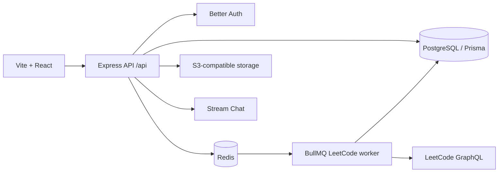

# Lumina architecture

Lumina is a Bun/Turborepo TypeScript monorepo. The current executable system is an Express API, Vite/React web client,
PostgreSQL/Prisma persistence, Redis/BullMQ asynchronous work, S3-compatible media storage, and Stream-backed chat.

## Backend

`demo/api/server.ts` composes Express middleware and mounts domain routers. Modules follow handler → service →
repository under `demo/api/modules`. Protected routes use `requireAuth`; the authenticated user is attached to the
Express request. The live modules are profiles, friends, posts, chat, leaderboard, and LeetCode sync.

## Frontend

`demo/web` is a Vite React single-page marketing/auth interface. Vite proxies `/api` to the Express server in
development. It has signup integration but no full product dashboard or route-based app shell yet.

## Data, cache, and jobs

The Prisma schema models multi-tenant campus data, social features, chat, events, marketplace, and internships.
PostgreSQL is durable storage. Redis supplies BullMQ and the sorted-set LeetCode leaderboard. The worker fetches
LeetCode statistics, stores durable profile data, then updates the Redis ranking.

## Authentication and external services

Better Auth uses Prisma-backed sessions and Resend for verification/reset email. S3-compatible storage handles profile
and post media. Stream Chat owns live chat-channel operations. AWS Secrets Manager is the production source for
credentials; see [SECRETS.md](../SECRETS.md).

## Deployment

Local Compose starts only PostgreSQL and Redis. API, worker, and web production images are separate. A production
orchestrator injects AWS Secrets Manager values at runtime and applies Prisma migrations with `migrate deploy`; see
[DOCKER.md](../DOCKER.md) and [DATABASE_MIGRATIONS.md](../DATABASE_MIGRATIONS.md).
